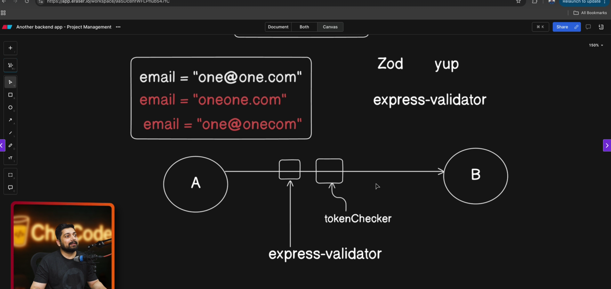

### Day 10 - Building a Complete Backend

- Learn to handle mongoose methods
- What are JWT Tokens
- Theory behind Access token and refresh
token


### Vid 125. Learn to handle mongoose methods
```js
userSchema.pre("save", async function (next) {
  if (!this.isModified("password")) return next();

  this.password = await brcypt.hash(this.password, 10);
  next();
});

userSchema.methods.isPasswordCorrect = async function (password) {
  return await brcypt.compare(password, this.password);
};

```
### Vid 126. What are JWT Tokens
- [JWT Resource](https://www.jwt.io/introduction#what-is-json-web-token)
- JSON Web Token (JWT) is an open standard (RFC 7519) that defines a compact and self-contained way for securely transmitting information between parties as a JSON object. This information can be verified and trusted because it is digitally signed. JWTs can be signed using a secret (with the HMAC algorithm) or a public/private key pair using RSA or ECDSA.
- when to use JSON Web tokens
    -  for authorization
    -  for information exchange

- syntax { Authorization:Bearer <token> }
- 
### Vid 127. Theory behind Access token and refresh token

- two types { access and refresh token }
- AccessToken -> 1d
- RefreshToken -> 10d
- token with and without data
- client server 
 