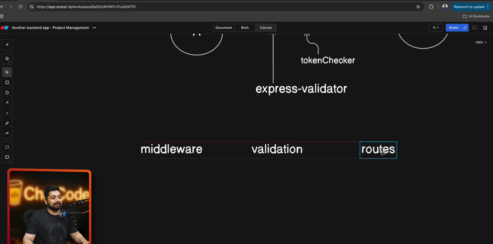
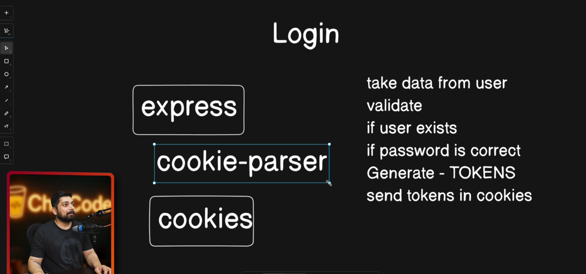

    ### +Day 13 - Building a Complete Backend

    - Writing custom validations
    - Login user with tokens and cookie data
    - Login validation and testing

    ### Vid 134. Writing custom validations

    - validation 
    - can come in more than one format
    - how validation works
    - zod , yup , express-validator 
    
    

    validator.middleware.js
    ```js
    import { validationResult } from "express-validator";
    import { ApiError } from "../utils/api-error.js";

    export const validate = (req, res, next) => {
    const errors = validationResult(req);
    if (errors.isEmpty()) {
        return next();
    }
    const extractedErrors = [];
    errors.array().map((err) =>
        extractedErrors.push({
        [err.path]: err.msg,
        }),
    );
    throw new ApiError(422, "Recieved data is not valid", extractedErrors);
    };

    ```

    - extract the error into an array using `extractErrors` and pass this on

    ### Vid 135. Login user with tokens and cookie data
    

    - `user.model.js`

    ```js
    import mongoose from "mongoose";

    const userSchema = new mongoose.Schema({
    email: String,
    password: String
    });

    export default mongoose.model("User", userSchema);
    ```

    ---

    - `auth.controller.js`

    ```js
    import User from "./user.model.js";
    import jwt from "jsonwebtoken";

    export const login = async (req, res) => {
    const { email, password } = req.body;

    const user = await User.findOne({ email });
    if (!user || user.password !== password) {
        return res.status(401).json({ message: "Invalid credentials" });
    }

    const accessToken = jwt.sign(
        { id: user._id },
        process.env.ACCESS_SECRET,
        { expiresIn: "15m" }
    );

    const refreshToken = jwt.sign(
        { id: user._id },
        process.env.REFRESH_SECRET,
        { expiresIn: "7d" }
    );

    res.cookie("refreshToken", refreshToken, {
        httpOnly: true,
        secure: true
    });

    res.json({ accessToken });
    };
    ```

    ---

    - `auth.route.js`

    ```js
    import express from "express";
    import { login } from "./auth.controller.js";

    const router = express.Router();

    router.post("/login", login);

    export default router;
    ```

    ---

    ## What happens

    * User logs in with email & password
    * **Access token** → sent in JSON
    * **Refresh token** → stored in **HTTP-only cookie**


    ### Vid 136. Login validation and testing

    ```js
    import { body } from "express-validator";
    import { AvailableUserRole } from "../utils/constants.js";
    const userRegisterValidator = () => {
    return [
        body("email")
        .trim()
        .notEmpty()
        .withMessage("Email is required")
        .isEmail()
        .withMessage("Email is invalid"),
        body("username")
        .trim()
        .notEmpty()
        .withMessage("Username is required")
        .isLowercase()
        .withMessage("Username must be in lower case")
        .isLength({ min: 3 })
        .withMessage("Username must be at least 3 characters long"),
        body("password").trim().notEmpty().withMessage("Password is required"),
        body("fullName").optional().trim(),
    ];
    };

    const userLoginValidator = () => {
    return [
        body("email").optional().isEmail().withMessage("Email is invalid"),
        body("password").notEmpty().withMessage("Password is required"),
    ];
    };

    const userChangeCurrentPasswordValidator = () => {
    return [
        body("oldPassword").notEmpty().withMessage("Old password is required"),
        body("newPassword").notEmpty().withMessage("New password is required"),
    ];
    };

    const userForgotPasswordValidator = () => {
    return [
        body("email")
        .notEmpty()
        .withMessage("Email is required")
        .isEmail()
        .withMessage("Email is invalid"),
    ];
    };

    const userResetForgotPasswordValidator = () => {
    return [body("newPassword").notEmpty().withMessage("Password is required")];
    };

    const createProjectValidator = () => {
    return [
        body("name").notEmpty().withMessage("Name is required"),
        body("description").optional(),
    ];
    };

    const addMembertoProjectValidator = () => {
    return [
        body("email")
        .trim()
        .notEmpty()
        .withMessage("Email is required")
        .isEmail()
        .withMessage("Email is invalid"),
        body("role")
        .notEmpty()
        .withMessage("Role is required")
        .isIn(AvailableUserRole)
        .withMessage("Role is invalid"),
    ];
    };

    export {
    userRegisterValidator,
    userLoginValidator,
    userChangeCurrentPasswordValidator,
    userForgotPasswordValidator,
    userResetForgotPasswordValidator,
    createProjectValidator,
    addMembertoProjectValidator,
    };

    ```