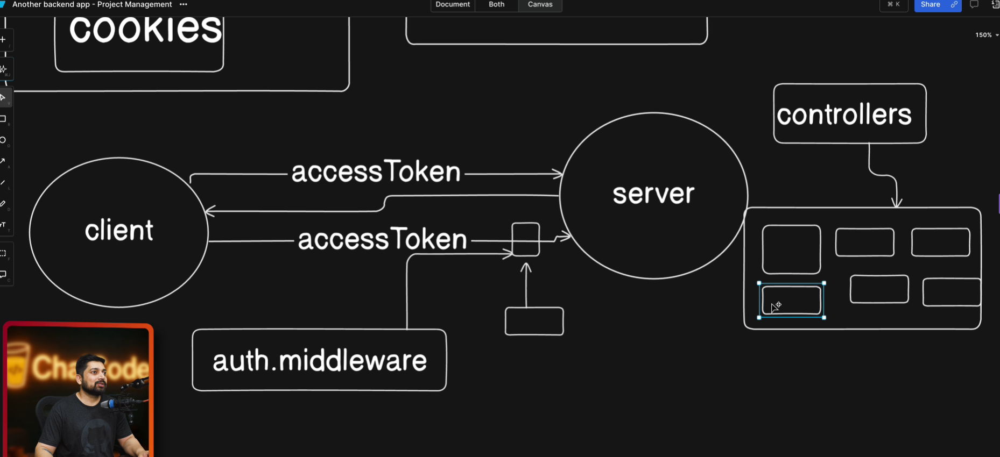
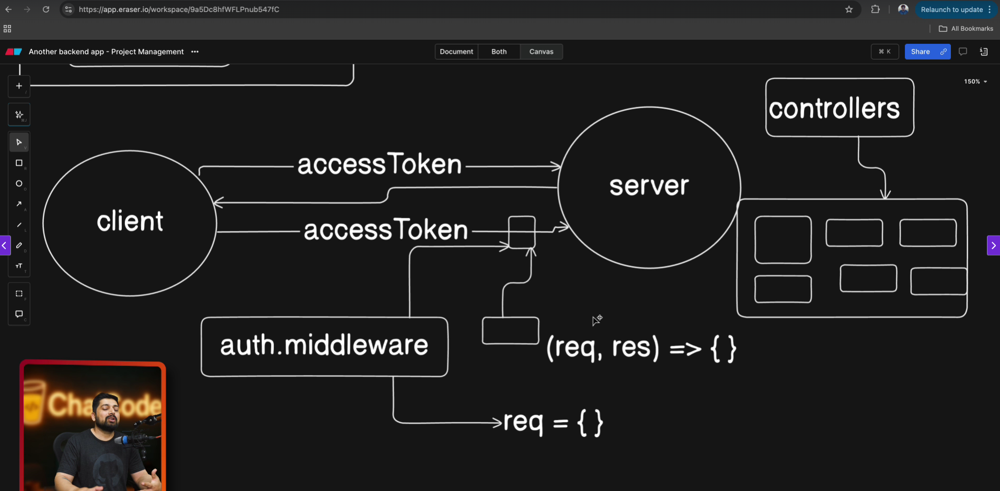
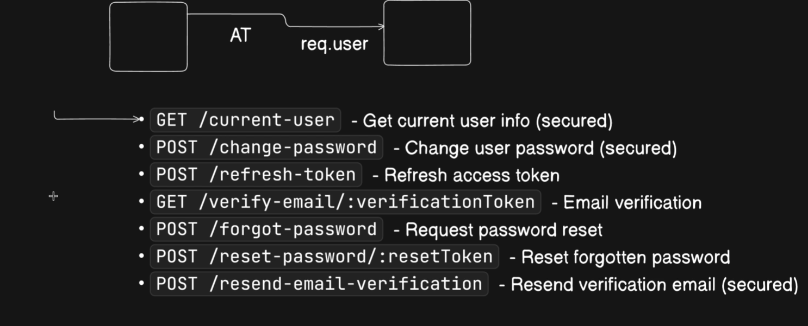

Day 14 - Building a Complete Backend

- Write auth middleware
- How to securely logout a user
- Refresh Access token and resend verification email


### Vid 137. Write auth middleware


- access token can reach via cookies and thorugh headers(in mobile phones)
- `auth.middleware.js`
```js
import { User } from "../models/user.models.js";
import { ProjectMember } from "../models/projectmember.models.js";
import { ApiError } from "../utils/api-error.js";
import { asyncHandler } from "../utils/async-handler.js";
import jwt from "jsonwebtoken";

export const verifyJWT = asyncHandler(async (req, res, next) => {
  const token =
    req.cookies?.accessToken ||
    req.header("Authorization")?.replace("Bearer ", "");

  if (!token) {
    throw new ApiError(401, "Unauthorized request");
  }

  try {
    const decodedToken = jwt.verify(token, process.env.ACCESS_TOKEN_SECRET);
    const user = await User.findById(decodedToken?._id).select(
      "-password -refreshToken -emailVerificationToken -emailVerificationExpiry",
    );

    if (!user) {
      throw new ApiError(401, "Invalid access token");
    }
    req.user = user;
    next();
  } catch (error) {
    throw new ApiError(401, "Invalid access token");
  }
});
```



### Vid 138. How to securely logout a user
 
 - logoutUser method in auth.controller.js

### Vid 139. Refresh Access token and resend verification 



- all the Routes Of POST  and some part of auth.controller.js

