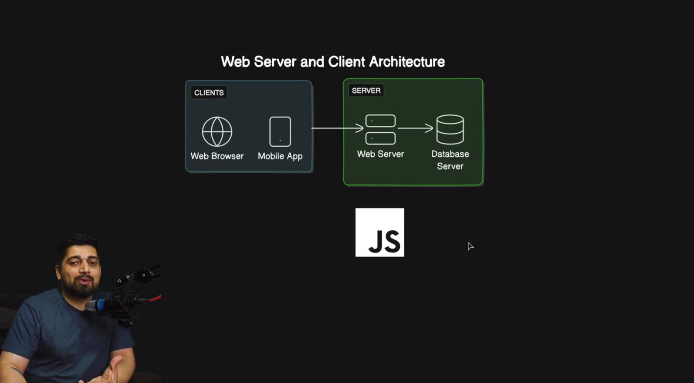
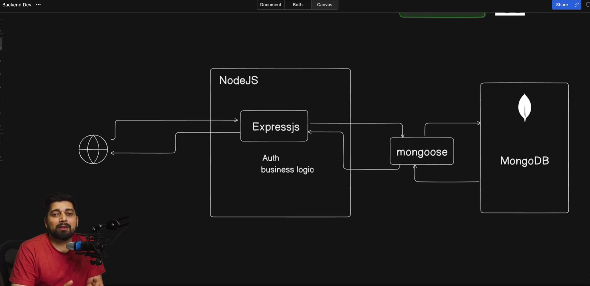

### Day 16 - Mega Project in Backend with MongoDB

- Complete backend series - Launch
- Building web server with Node and Bun
- Express crash course with Postman testing


### Vid 143. Complete backend series - Launch

- Backend 
- any one langauge
- basic of backend are same everywhere
- prerequisites
- js knowledge
- postmand and nodejs installed on pc 
- vs code or any other ide 
### Vid 144. Building web server with Node and Bun
- web server and client architechture 


- made own server using node and bun 

```js
const http = require("http");

const hostname = "127.0.0.1";
const port = 3000;

const server = http.createServer((req, res) => {
  if (req.url === "/") {
    res.statusCode = 200;
    res.setHeader("Content-Type", "text/plain");
    res.end("Hello Ice Tea");
  } 
  else if (req.url === "/ice-tea") {
    res.statusCode = 200;
    res.setHeader("Content-Type", "text/plain");
    res.end("Thanks for ordering Ice Tea, it's really hot");
  } 
  else {
    res.statusCode = 404;
    res.setHeader("Content-Type", "text/plain");
    res.end("404 Not Found");
  }
});

server.listen(port, hostname, () => {
  console.log(`Server is listening at http://${hostname}:${port}`);
});

```

server-bun.js
```js

```
### Vid 145. Express crash course with Postman testing



- express helps writing routes very easier 
- `index.js`
```js
import "dotenv/config";
import express from "express";

const app = express();
const port = process.env.PORT || 3000;

/*
app.get("/", (req, res) => {
  res.send("Hello from Hitesh and his tea!");
});

app.get("/ice-tea", (req, res) => {
  res.send("What ice tea would you prefer?");
});

app.get("/twitter", (req, res) => {
  res.send("hiteshdotcom");
});
*/

app.use(express.json());

let teaData = [];
let nextId = 1;

// add a new tea
app.post("/teas", (req, res) => {
  const { name, price } = req.body;
  const newTea = {
    id: nextId++,
    name,
    price,
  };
  teaData.push(newTea);
  res.status(201).send(newTea);
});

// get all teas
app.get("/teas", (req, res) => {
  res.status(200).send(teaData);
});

// get a tea with id
app.get("/teas/:id", (req, res) => {
  const tea = teaData.find((tea) => tea.id === parseInt(req.params.id));
  if (!tea) {
    return res.status(404).send("Tea not found");
  }

  res.status(200).send(tea);
});

// update tea
app.put("/teas/:id", (req, res) => {
  const tea = teaData.find((tea) => tea.id === parseInt(req.params.id));
  if (!tea) {
    return res.status(404).send("Tea not found");
  }

  const { name, price } = req.body;
  tea.name = name;
  tea.price = price;

  res.status(200).send(tea);
});

// delete tea
app.delete("/teas/:id", (req, res) => {
  const index = teaData.findIndex((tea) => tea.id === parseInt(req.params.id));
  if (index === -1) {
    return res.status(404).send("Tea not found");
  }

  teaData.splice(index, 1);
  res.status(204).send("Deleted");
});

app.listen(port, () => {
  console.log(`Server is running at http://localhost:${port}/`);
});

```