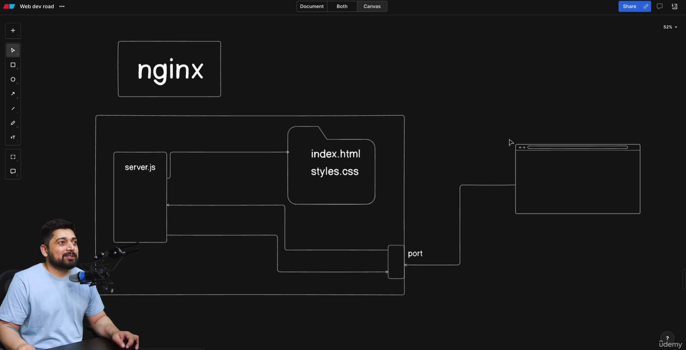
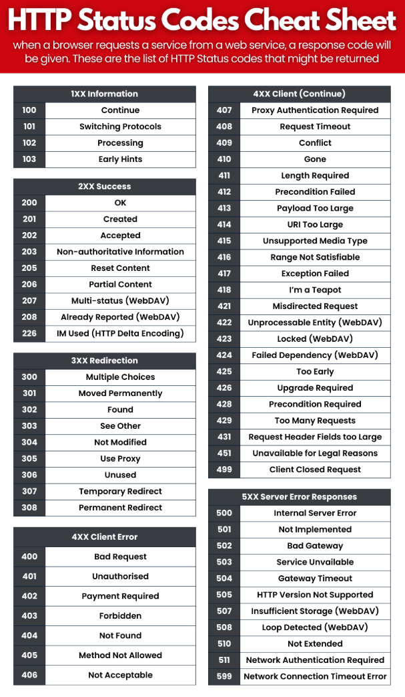

## Day 2 - Journey of Backend with NodeJS and Projects

## Tasks
- Build your own Nginx server with NodeJS
- Event Driven Architecture - Build your own logger

### Learnings from Lecture
### Vid 99. Build your own Nginx server with NodeJS 

- what servers actually are 
- what is nginx ?
    - one of most popluar web server 
    - apache was popular before
    - serving static files

 

Setup 
- create index,contact,about page
- create server.js 
- req/res has two parts one is head(metadeta) and another is body(content)
- we use ternmary operator in many places (condition ? true_value : false_value)
- MIME types are standardized strings that helps in telling server the format or category of digital content 

HTTP Server & Static Files – Node.js (Short Notes)

- A server listens for client requests and sends responses
- HTTP server is created using Node.js `http` module
- Nginx is a popular web server used for serving static files
- Apache was widely used before Nginx
- Node.js can also act as a basic web server
- Server runs on a specific port (e.g., 3000)
- `req` (request) contains URL and headers (metadata)
- `res` (response) sends headers and body (content)
- `path` module helps resolve file paths safely
- Ternary operator is used for conditional routing (`/` → index.html)
- File extension is extracted to identify content type
- MIME types tell the browser what kind of file is being sent
- Default MIME type is `application/octet-stream`
- `fs.readFile()` is used to serve static files
- 404 error is sent when file is not found
- 500 error is sent for server-side issues
- Server starts listening using `server.listen()`
- This mimics how Nginx serves static content


[server.js](./Day-2/server.js)
```js
const http = require("http");
const fs = require("fs");
const path = require("path");

const port = 3000;

const server = http.createServer((req, res) => {
  const filePath = path.join(
    __dirname,
    req.url === "/" ? "index.html" : req.url
  );

  const extName = path.extname(filePath).toLocaleLowerCase();

  let mimeTypes = {
    ".html": "text/html",
    ".css": "text/css",
    ".js": "text/javascript",
    ".png": "image/png",
  };

  const contentType = mimeTypes[extName] || "application/octet-stream";

  fs.readFile(filePath, (err, content) => {
    if (err) {
      if (err.code === "ENOENT") {
        res.writeHead(404, { "Content-Type": "text/html" });
        res.end("404: File not found bro");
      } else {
        res.writeHead(500);
        res.end(`Server Error: ${err.code}`);
      }
    } else {
      res.writeHead(200, { "Content-Type": contentType });
      res.end(content, "utf8");
    }
  });
});

server.listen(port, () => {
  console.log(`Server is listening on port ${port}`);
});

```


- HTTP Status Codes 



### Vid 100. Event Driven Architecture - Build your own logger

Event Loggers 
Power of Node Js 

- Event & Logger
- Datadog , Sentry 
- Winston is a widely-used, production-grade Node.js logger
- How events can be used 
- Socket and even driven architecture
- [Events in Nodejs](https://nodejs.org/api/events.html)
- [OS](https://nodejs.org/api/os.html)

 - Node.js follows an event-driven, non-blocking architecture
- EventEmitter is used to create and handle custom events
- Logger extends EventEmitter to emit log events
- `emit()` sends events, `on()` listens to events
- Logger is decoupled from log storage logic
- File System (`fs`) module is used to store logs in a file
- Each log entry is saved with a timestamp
- OS module provides system-level information
- Memory usage is calculated using `freemem()` and `totalmem()`
- `setInterval()` is used for periodic logging
- Logs application lifecycle events (start, system status)
- Same event pattern is used in Winston, Sentry, Datadog
- Useful for monitoring, debugging, and production logging

[logger.js](./Day-2/logger.js)
```js
const fs = require("fs");
const os = require("os");

const EventEmitter = require("events");

class Logger extends EventEmitter {
  log(message) {
    this.emit("message", { message });
  }
}

const logger = new Logger();
const logFile = "./eventlog.txt";

const logToFile = (event) => {
  const logMessage = `${new Date().toISOString()} - ${event.message}\n`;
  fs.appendFileSync(logFile, logMessage);
};

logger.on("message", logToFile);

setInterval(() => {
  const memoryUsage = (os.freemem() / os.totalmem()) * 100;
  logger.log(`Current memory usage: ${memoryUsage.toFixed(2)}`);
}, 3000);

logger.log("Application Started");
logger.log("Application event occured");

```