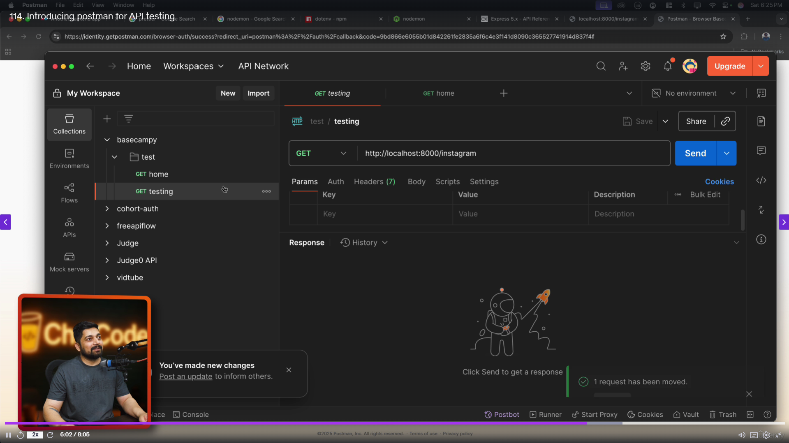

### Day 6 - Building a Complete Backend

- A professional project structure
- Setup of basic express server
- Introducing postman for API testing


### Vid 112. A professional project structure 

- restructuring this project 
- automatic restructing of project structure using `nestjs` like framework
-  Folder Structure

```
public/
└── images/

src/
├── controllers/
├── db/
├── middlewares/
├── models/
├── routes/
├── utils/
└── validators/
```
- **controllers** – Contains the request handling logic and connects routes with business logic.
- **db** – Manages database configuration, connections, and initialization logic.
- **middlewares** – Holds middleware functions for request processing like authentication, logging, and error handling.
- **models** – Defines data schemas and models used to interact with the database.
- **routes** – Declares application routes and maps them to controller functions.
- **utils** – Includes reusable helper functions and common utilities.
- **validators** – Handles request data validation to ensure correct and safe inputs.


### Vid 113. Setup of basic express server

- For Routing Library we are using `express` and for database we are using `mongo`
- we use mongoose for interacting to mongoDB 
- express is web framework for nodejs
- express starter
```js
import express from 'express'
const app = express()
app.get('/', (req, res) => {
  res.send('Hello World!')
})

app.listen(port, () => {
  console.log(`Example app listening on port ${port}`)
})
```

- The app object has methods for
- Routing HTTP requests; see for example, app.METHOD and app.param.
- Configuring middleware; see app.route.
- Rendering HTML views; see app.render.
- Registering a template engine; see app.engine.

### Vid 114. Introducing postman for API testing

- get request can be handled using browser 
- but for other request we need tools like Postman , Insomnia
- we can use app like postman or use vscode extension 

