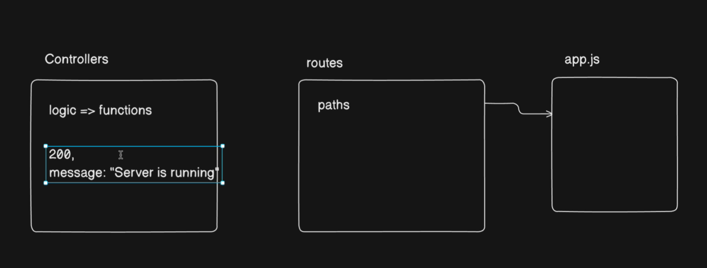

### Day 8 - Building a Complete Backend

- How to connect with mongoDB
- A guide on mongodb Atlas connection
- Write a healthcheck controller and routes

### Vid 119. How to connect with mongoDB

- MONGO_URI in dotenv 
- inside db folder 
index.js
```js
import mongoose from 'mongoose'

const connectDB=async () =>{
    try{
        await mongoose.connect(process.env.MONGO_URI)
        console.log("✅ MongoDB Connected")
    }catch(error){
        console.error("MongoDB Connection error",error)
        process.exit(1)
    }
}
export default connectDB()
```
### Vid 120. A guide on mongodb Atlas connection

- atlas is online service provided by monogodb
- atlas give free 500mb cluster for free
- remove the 0.0.0.0/0 when putting the project in production 
- its for develoepment purpose only
- import the connectDB to home index

in index at home 
```js
import dotenv from "dotenv";
import app from "./app.js";
import connectDB from "./db/index.js";

dotenv.config({
  path: "./.env",
});

const port = process.env.PORT || 3000;

connectDB()
  .then(() => {
    app.listen(port, () => {
      console.log(`Example app listening on port http://localhost:${port}`);
    });
  })
  .catch((err) => {
    console.error("MongoDB connection error", err);
    process.exit(1);
  });

```


### Vid 121. Write a healthcheck controller and routes



controllers > healthcheck.controllers.js
```js
import { ApiResponse } from "../utils/api-response.js";
import { asyncHandler } from "../utils/async-handler.js";

/**
const healthCheck = async (req, res, next) => {
  try {
    const user = await getUserFromDB()
    res
      .status(200)
      .json(new ApiResponse(200, { message: "Server is running" }));
  } catch (error) {
    next(err)
  }
};
 */

const healthCheck = asyncHandler(async (req, res) => {
  res.status(200).json(new ApiResponse(200, { message: "Server is running" }));
});

export { healthCheck };

```
- about naming it will help tell its a contorller of healthcheck 
- 

routes > healthcheck.routes.js
```js
import { Router } from "express";
import { healthCheck } from "../controllers/healthcheck.controllers.js";

const router = Router();

router.route("/").get(healthCheck);

export default router;

```

- don't forget to put 
- /api/v1/healthcheck  prefix 


