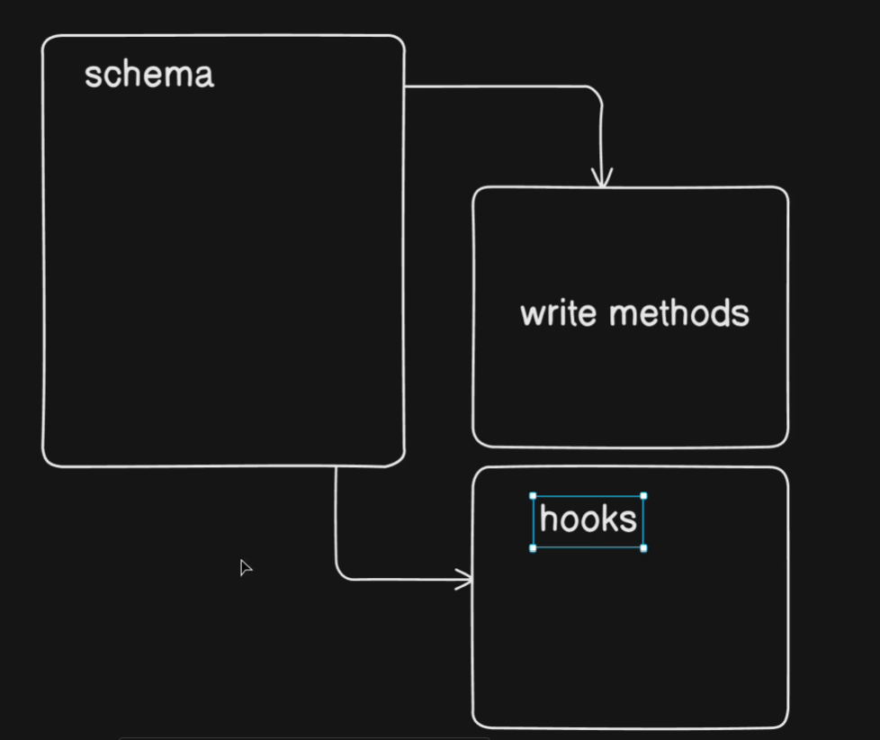

### Day 9 - Building a Complete Backend

- Catch errors better with async Handlers
-  Learn to write user schema in mongoose
-  Hash the password with pre hooks of
mongoose


### Vid 122. Catch errors better with async Handlers
- when talking to database always remember two things
    - "Database may throw errors"
    - "Database is on another continent" means it will always take some time 
- had to put await and async 

aysnc-handler.js
```js
const asyncHandler = (requestHandler) => {
  return (req, res, next) => {
    Promise.resolve(requestHandler(req, res, next)).catch((err) => next(err));
  };
};

export { asyncHandler };

```

- higher order functions , promise 
- req ,res and next 


### Vid 123. Learn to write user schema in mongoose

- registration of the user 
- user.models.js
```js
import mongoose, { Schema } from "mongoose";
import brcypt from "bcrypt";
import jwt from "jsonwebtoken";
import crypto from "crypto";

const userSchema = new Schema(
  {
    avatar: {
      type: {
        url: String,
        localPath: String,
      },
      default: {
        url: `https://placehold.co/200x200`,
        localPath: "",
      },
    },
    username: {
      type: String,
      required: true,
      unique: true,
      lowercase: true,
      trim: true,
      index: true,
    },
    email: {
      type: String,
      required: true,
      unique: true,
      lowercase: true,
      trim: true,
    },
    fullName: {
      type: String,
      trim: true,
    },
    password: {
      type: String,
      required: [true, "Password is required"],
    },
    isEmailVerified: {
      type: Boolean,
      default: false,
    },
    refreshToken: {
      type: String,
    },
    forgotPasswordToken: {
      type: String,
    },
    forgotPasswordExpiry: {
      type: Date,
    },
    emailVerificationToken: {
      type: String,
    },
    emailVerificationExpiry: {
      type: Date,
    },
  },
  {
    timestamps: true,
  },
);

userSchema.pre("save", async function (next) {
  if (!this.isModified("password")) return next();

  this.password = await brcypt.hash(this.password, 10);
  next();
});

userSchema.methods.isPasswordCorrect = async function (password) {
  return await brcypt.compare(password, this.password);
};

userSchema.methods.generateAccessToken = function () {
  return jwt.sign(
    {
      _id: this._id,
      email: this.email,
      username: this.username,
    },
    process.env.ACCESS_TOKEN_SECRET,
    { expiresIn: process.env.ACCESS_TOKEN_EXPIRY },
  );
};

userSchema.methods.generateRefreshToken = function () {
  return jwt.sign(
    {
      _id: this._id,
    },
    process.env.REFRESH_TOKEN_SECRET,
    { expiresIn: process.env.REFRESH_TOKEN_EXPIRY },
  );
};

userSchema.methods.generateTemporaryToken = function () {
    const unHashedToken = crypto.randomBytes(20).toString("hex")

    const hashedToken = crypto
        .createHash("sha256")
        .update(unHashedToken)
        .digest("hex")

    const tokenExpiry = Date.now() + (20*60*1000) //20 mins
    return {unHashedToken, hashedToken, tokenExpiry}
};

export const User = mongoose.model("User", userSchema);

```
- model using mongooose 
- Schema types 
- Number: Used for numeric data like counts or prices.
- Date: Used for dates and timestamps.
- Boolean: Used for true/false values.
- Buffer: Used for storing binary data, like images or audio files.
- ObjectId: A 12-byte BSON type typically used as the primary key (_id) for documents, and for referencing documents in other collections (relationships).
- Array: Stores multiple values in a single field. Arrays can contain values of the same or different types, or even subdocuments.
- Decimal128: High-precision floating-point numbers, useful for financial data where accuracy is critical.
- Map: A data structure for storing key-value pairs, similar to a JavaScript object.
- Mixed: Allows for any type of data in a field, useful when the data structure is dynamic and unpredictable.
- UUID: Used for storing Universally Unique Identifiers. 



### Vid 124. Hash the password with pre hooks of mongoose

```js
userSchema.methods.generateTemporaryToken = function () {
    const unHashedToken = crypto.randomBytes(20).toString("hex")

    const hashedToken = crypto
        .createHash("sha256")
        .update(unHashedToken)
        .digest("hex")

    const tokenExpiry = Date.now() + (20*60*1000) //20 mins
    return {unHashedToken, hashedToken, tokenExpiry}
}
```